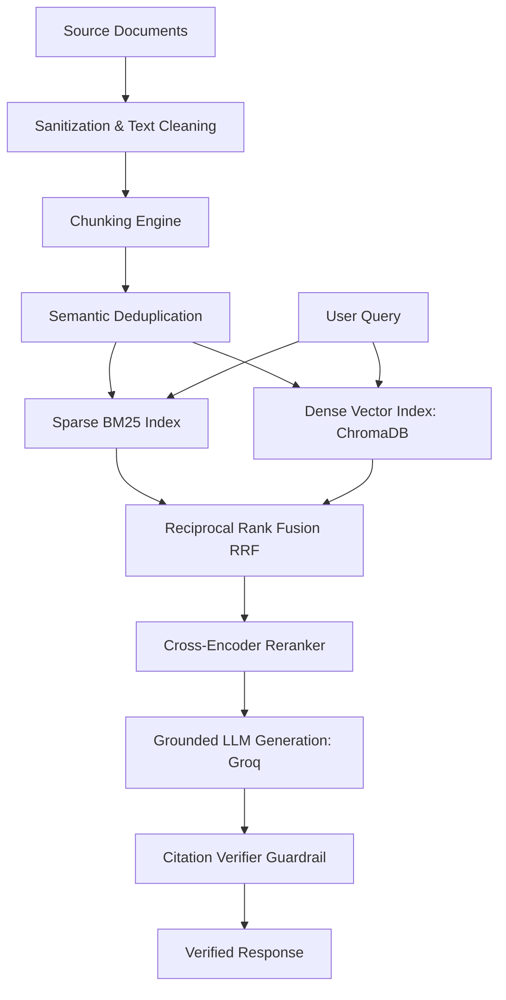

# Hybrid RAG Engine for Document Search & Question Answering

A fast, accurate, and reliable Retrieval-Augmented Generation (RAG) system designed to answer questions from your PDF, Markdown, HTML, and TXT documents with verified citations.

[](https://www.python.org/)
[](https://fastapi.tiangolo.com/)
[](https://streamlit.io/)
[](https://www.docker.com/)
[](LICENSE)

---

## Overview

This project provides an end-to-end RAG pipeline that combines **keyword search (BM25)** and **semantic vector search (ChromaDB)** to find the most relevant document passages. Top results are combined using **Reciprocal Rank Fusion (RRF)** and re-ranked with a **Cross-Encoder model** before being sent to an LLM (Groq / Llama 3) for answer generation. 

To ensure reliability, the system automatically checks generated citations back to the source text to prevent hallucinations.

---

## Project Preview


*Streamlit Interface: Ask questions, verify citations, and upload documents.*

---

## Key Features

* **Hybrid Search**: Combines exact keyword matching (BM25) with semantic vector search (ChromaDB) for high retrieval accuracy.
* **Smart Re-Ranking**: Uses a Cross-Encoder model (`ms-marco-MiniLM-L-6-v2`) to rank document chunks so the LLM gets only the best context.
* **Verified Citations**: Checks bracketed references (e.g., `[1]`) against source documents to prevent wrong or fabricated answers.
* **Automatic Deduplication**: Filters out duplicate document chunks (>95% similarity) to save LLM tokens and reduce costs.
* **Clean Text Processing**: Handles messy text, weird characters, and PDF formatting issues automatically.
* **Flexible Setup**: Can run as a simple standalone app or split into a FastAPI backend and Streamlit frontend.

---

## How It Works

1. **Document Ingestion**: Files are cleaned, broken into chunks, deduplicated, and stored in both BM25 (keyword index) and ChromaDB (vector database).
2. **Hybrid Search**: When a user asks a question, both BM25 and ChromaDB search for relevant chunks.
3. **Fusion & Re-ranking**: Results are merged using Reciprocal Rank Fusion (RRF) and scored by a Cross-Encoder.
4. **Answer Generation**: The top chunks are sent to the LLM (Groq) to craft a clear answer.
5. **Citation Audit**: The system verifies that all cited sources exist in the retrieved context.



---

## Tech Stack

| Category | Technology | Description |
| :--- | :--- | :--- |
| **Language** | Python | Primary programming language (3.10+). |
| **Backend API** | FastAPI / Uvicorn | High-performance REST API endpoints. |
| **Frontend UI** | Streamlit | Simple interactive web interface. |
| **Embeddings & Re-ranking** | SentenceTransformers | Local embedding model (`all-MiniLM-L6-v2`) and Cross-Encoder (`ms-marco-MiniLM-L-6-v2`). |
| **Keyword Search** | Rank-BM25 | BM25Okapi implementation for keyword search. |
| **Vector Database** | ChromaDB | Lightweight local vector database using HNSW indexing. |
| **LLM Provider** | Groq SDK | Fast LLM inference (`llama-3.1-8b-instant`). |
| **Containerization** | Docker / Compose | Easy multi-service deployment. |
| **Testing** | Pytest | Automated tests for code quality. |

---

## Project Structure

```text
Advanced-NLP-Search-Retrieval-Engine/
├── backend/                  # FastAPI backend microservice & core RAG engine
│   ├── app/                  # Application modules
│   │   ├── evaluation/       # RAG performance evaluation scripts
│   │   ├── generation/       # LLM prompt building and citation verification
│   │   ├── indexing/         # BM25, ChromaDB, and hybrid search logic
│   │   ├── ingestion/        # Document parsing, chunking, and deduplication
│   │   ├── reranking/        # Cross-Encoder re-ranking module
│   │   ├── config.py         # Backend configuration & system paths
│   │   └── main.py           # FastAPI application entrypoint
│   ├── data/                 # Vector database (ChromaDB) and sparse index files
│   ├── sample_data/          # Example policy documents for testing
│   ├── tests/                # Automated unit and API test suite
│   ├── Dockerfile            # Container configuration for backend API
│   ├── requirements.txt      # Backend Python dependencies
│   ├── run.py                # Direct runner for FastAPI backend
│   └── README.md             # Backend service documentation
├── frontend/                 # Streamlit web user interface
│   ├── src/                  # Frontend source code
│   │   └── app.py            # Streamlit dashboard application
│   ├── .streamlit/           # Streamlit server configuration
│   ├── app.py                # Root launcher wrapper
│   ├── Dockerfile            # Container configuration for frontend UI
│   ├── requirements.txt      # Lightweight frontend dependencies
│   ├── run.py                # Direct runner for Streamlit frontend
│   └── README.md             # Frontend dashboard documentation
├── .devcontainer/            # VS Code remote container configuration
├── .github/workflows/        # CI/CD pipelines (testing & linting)
├── Dockerfile                # Root container configuration
├── docker-compose.yaml       # Multi-service orchestration (API + UI)
├── Makefile                  # Developer shortcuts (setup, run, test, lint)
├── pyproject.toml            # Project package configuration & tool settings
├── requirements.txt          # Unified dependencies
├── run.py                    # Root entrypoint for launching UI
└── README.md                 # Project documentation
```

### Folder Breakdown
- `backend/app/ingestion/`: Parses documents (PDF, HTML, MD, TXT), cleans text, chunks content, and removes duplicates.
- `backend/app/indexing/`: Handles BM25 keyword search, ChromaDB vector storage, and Reciprocal Rank Fusion.
- `backend/app/reranking/`: Uses a Cross-Encoder model (`ms-marco-MiniLM-L-6-v2`) to prioritize relevant text chunks.
- `backend/app/generation/`: Prompts the Groq LLM and performs citation verification guardrail audits.
- `backend/data/`: Persistent storage for ChromaDB embeddings and BM25 serialized indexes.
- `backend/tests/`: Automated unit tests for API endpoints, ingestion, retrieval, and citation verification.
- `frontend/src/`: Streamlit interactive dashboard with query interface, diagnostic audits, and document ingestion.

---

## Getting Started

### Prerequisites
- Python 3.10, 3.11, or 3.12
- Git
- A Groq API key (Get one free at [Groq Console](https://console.groq.com/))

### 1. Clone the Repository
```bash
git clone https://github.com/divyyadav007/RAG-Pipeline-with-Hybrid-Search-Over-Internal-Docs.git
cd Advanced-NLP-Search-Retrieval-Engine
```

### 2. Set Up Environment Variables
Create a `.env` file in the project root folder (or inside `backend/`):
```bash
GROQ_API_KEY="your_groq_api_key_here"
```

### 3. Option A: Run Services Independently

#### Run Backend API:
```bash
# In terminal 1:
cd backend
python -m venv venv
# On Windows: .\venv\Scripts\Activate.ps1 | On Unix: source venv/bin/activate
pip install -r requirements.txt
python run.py
```
- Interactive Swagger API docs available at: `http://localhost:8000/docs`

#### Run Frontend UI:
```bash
# In terminal 2:
cd frontend
python -m venv venv
# On Windows: .\venv\Scripts\Activate.ps1 | On Unix: source venv/bin/activate
pip install -r requirements.txt
python run.py
```
- Access the web interface at: `http://localhost:8501`

### 4. Option B: Run via Makefile Shortcuts
```bash
# Terminal 1: Run Backend
make run-backend

# Terminal 2: Run Frontend
make run-frontend

# Run Tests
make test
```

---

### Running with Docker

You can run both the API and Web UI together using Docker Compose:

```bash
# Set your API key first:
# Linux/macOS:
export GROQ_API_KEY="your_groq_api_key_here"

# Windows PowerShell:
$env:GROQ_API_KEY="your_groq_api_key_here"

# Start the services:
docker compose up --build
```

---

## Environment Variables

| Variable | Description | Required |
| :--- | :--- | :---: |
| `GROQ_API_KEY` | API key for Groq LLM service. | **Yes** |
| `BACKEND_API_URL` | Base URL of the backend FastAPI service (e.g., `http://localhost:8000`). | Optional |
| `PYTHONPATH` | Python import path (usually auto-configured). | Optional |

---

## Quick Usage Guide

1. Open `http://localhost:8501` in your web browser.
2. **Upload Documents**: In the right sidebar, select a file (`.pdf`, `.md`, `.txt`, `.html`) and click **Trigger Asset Ingestion Pipeline** to process and index it.
3. **Ask Questions**: Type your question in the search box (e.g., *"What is the minimum attendance requirement for university exams?"*) and click **Execute Intelligence Query**.
4. **Check Results**: View the generated answer along with verified source citations.

---

## API Endpoints

| Method | Endpoint | Description |
| :--- | :--- | :--- |
| `GET` | `/` | Checks if the API is running and returns basic metadata. |
| `POST` | `/v1/ingest` | Processes, chunks, deduplicates, and indexes a document. |
| `POST` | `/v1/ask` | Runs hybrid search, re-ranks contexts, generates an answer, and verifies citations. |
| `GET` | `/health` | Health check endpoint. |

---

## Roadmap & Future Enhancements

- Metadata pre-filtering (by category, document type, or date).
- Multi-turn chat memory for continuous conversations.
- Background job processing for very large documents.
- Support for offline LLMs using Ollama or llama.cpp.

---

## License

Distributed under the MIT License. See [LICENSE](LICENSE) for details.
