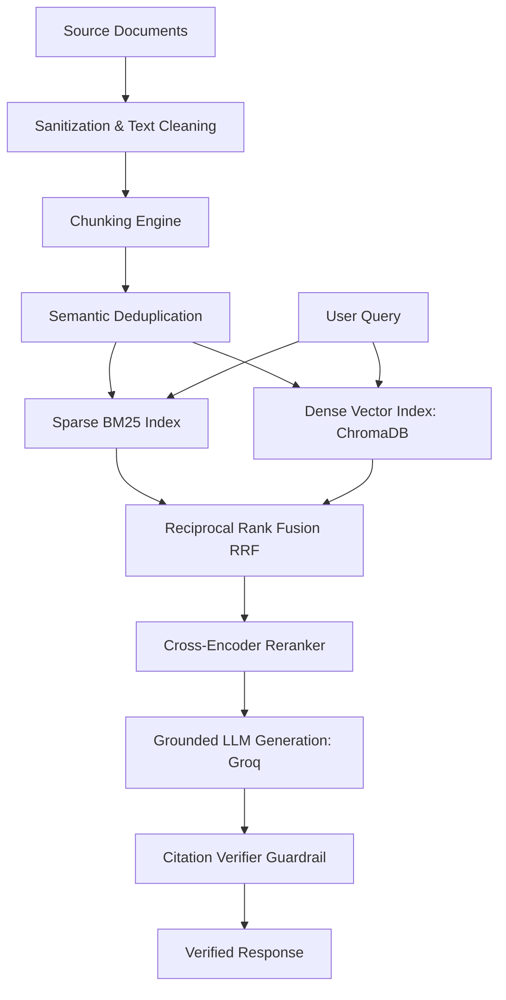

# Enterprise Hybrid RAG Engine

A Retrieval-Augmented Generation (RAG) system combining lexical keyword search (BM25) and dense vector search (ChromaDB) to provide accurate, citation-backed answers over internal documents.

---

## Overview

### What This Project Does
This project processes internal documents (PDF, Markdown, HTML, TXT), stores them in search indexes, and answers user questions by retrieving relevant context and generating grounded responses using a Large Language Model (LLM).

### What Problem It Solves
Standard keyword search fails when users ask questions using synonyms, while pure vector search often misses exact policy numbers, codes, or technical identifiers. Additionally, LLMs can generate plausible but incorrect answers (hallucinations) if not grounded in source text. 

This engine solves these issues by pairing keyword search with vector search, refining results with a re-ranker, and running an automated citation check to verify every answer against source text.

### Who Should Use It
- Organizations managing internal policy, compliance, or HR handbooks.
- Developers building domain-specific document search interfaces.
- AI engineers looking for a clean hybrid retrieval and re-ranking baseline.

---

## Features

- **Multi-Format Ingestion**: Supports parsing text from PDF, Markdown, HTML, and TXT files.
- **Unicode & Text Cleaning**: Removes null bytes and corrupted PDF characters to prevent parsing and database errors.
- **Header & Window Chunking**: Uses Markdown header boundaries for structured docs and sliding character windows for plain text.
- **Semantic Chunk Deduplication**: Drops duplicate text chunks with >95% similarity before indexing to save storage and LLM tokens.
- **Hybrid Search (RRF)**: Combines sparse BM25 keyword search with dense ChromaDB vector search using Reciprocal Rank Fusion.
- **Cross-Encoder Re-Ranking**: Re-scores top search results with a Cross-Encoder transformer model to select the most relevant context.
- **Grounded Answer Generation**: Uses Groq API (`llama-3.1-8b-instant`) in JSON mode to output structured answers.
- **Citation Verification Guardrail**: Scans bracketed citations (e.g. `[1]`) to ensure answers link directly back to valid source context.
- **Automated RAG Benchmarking**: Includes an LLM-as-a-Judge script (`src/evaluation/metrics_runner.py`) measuring Faithfulness and Answer Relevancy.

---

## Architecture Overview

When a document is uploaded, it is cleaned, split into chunks, deduplicated, and indexed into both a BM25 sparse index and a ChromaDB dense vector store.

When a query is submitted, both search indexes retrieve candidate chunks. Reciprocal Rank Fusion (RRF) merges the results, a Cross-Encoder re-ranks top candidates, the LLM generates an answer based on those context blocks, and a verifier checks the citations.



---

## Tech Stack

| Category | Technology | Usage Rationale |
| :--- | :--- | :--- |
| **Languages** | Python | Core programming language for AI/ML pipelines and API backend. |
| **Backend** | FastAPI / Uvicorn | High-performance asynchronous web framework for REST API endpoints. |
| **Frontend** | Streamlit | Python-native web interface framework for interactive dashboards. |
| **AI / ML** | SentenceTransformers | Local embedding model (`all-MiniLM-L6-v2`) and re-ranker (`ms-marco-MiniLM-L-6-v2`). |
| **AI / ML** | Rank-BM25 | BM25Okapi algorithm implementation for lexical keyword search. |
| **AI / ML** | Groq SDK | High-speed LLM inference API (`llama-3.1-8b-instant`). |
| **Database** | ChromaDB | Local vector database using HNSW graph indexing and persistent SQLite storage. |
| **Tools** | Docker / Compose | Containerization for reproducible microservice deployment. |
| **Tools** | Pytest | Test framework for unit and API route verification. |

---

## Folder Structure

```text
Advanced-NLP-Search-Retrieval-Engine/
├── data/                 # ChromaDB vector database and sparse index files
├── sample_data/          # Reference sample policy document
├── src/                  # Core source code modules
│   ├── evaluation/       # RAG metric evaluation scripts
│   ├── generation/       # LLM generation and citation verifier
│   ├── indexing/         # BM25, ChromaDB, and hybrid retrieval logic
│   ├── ingestion/        # Parsers, chunkers, and deduplication logic
│   ├── reranking/        # Cross-Encoder model re-ranking
│   └── ui/               # Streamlit application dashboard
├── tests/                # Automated unit test suite
├── Dockerfile            # Container definition
├── docker-compose.yaml   # Multi-container orchestration specification
├── Makefile              # Utility command shortcuts
├── pyproject.toml        # Package and tool configuration
├── requirements.txt      # Dependency manifest
├── run.py                # Streamlit UI direct entrypoint
└── README.md             # Project documentation
```

### Purpose of Key Folders
- `src/ingestion/`: Parses documents (PDF, HTML, MD, TXT), cleans text, chunks documents, and removes duplicate content.
- `src/indexing/`: Manages sparse BM25 indexing, ChromaDB vector database storage, and Reciprocal Rank Fusion.
- `src/reranking/`: Uses a Cross-Encoder model to select the top context blocks for the LLM.
- `src/generation/`: Builds prompts for Groq LLM generation and verifies cited references.
- `src/ui/`: Contains the Streamlit user dashboard code.
- `tests/`: Unit tests for API endpoints, ingestion, retrieval, and verification logic.

---

## Installation

### Prerequisites
- Python 3.10, 3.11, or 3.12
- Git
- A Groq API key from [Groq Console](https://console.groq.com/)

### Step 1: Clone Repository
```bash
git clone https://github.com/divyyadav007/RAG-Pipeline-with-Hybrid-Search-Over-Internal-Docs.git
cd Advanced-NLP-Search-Retrieval-Engine
```

### Step 2: Create Virtual Environment
```bash
# On Linux / macOS
python3 -m venv myvenv
source myvenv/bin/activate

# On Windows (PowerShell)
python -m venv myvenv
.\myvenv\Scripts\Activate.ps1
```

### Step 3: Install Dependencies
```bash
pip install --upgrade pip
pip install -r requirements.txt
```

### Step 4: Configure Environment Variables
Create a `.env` file in the root directory:
```bash
GROQ_API_KEY="your_groq_api_key_here"
```

### Step 5: Run Backend API
```bash
uvicorn src.main:app --host 0.0.0.0 --port 8000 --reload
```
- API Documentation: `http://localhost:8000/docs`

### Step 6: Run Frontend UI
In a separate terminal window:
```bash
python run.py
```
- Web Application: `http://localhost:8501`

### Running via Docker Compose
To run both backend API and frontend UI in containers:
```bash
# Set environment variable and start containers
export GROQ_API_KEY="your_groq_api_key_here"   # On Linux/macOS
$env:GROQ_API_KEY="your_groq_api_key_here"      # On Windows PowerShell

docker compose up --build
```

---

## Environment Variables

| Variable | Description | Required |
| :--- | :--- | :---: |
| `GROQ_API_KEY` | API authentication key for Groq LLM inference services. | **Yes** |
| `BACKEND_API_URL` | Base URL of backend FastAPI service. Used by Streamlit UI in microservice mode. | Optional |
| `PYTHONPATH` | Root path for resolving local Python module imports. | Optional |

---

## Usage

1. Open the web interface at `http://localhost:8501`.
2. **Ingest Documents**: In the right-hand panel, upload a document (`.pdf`, `.md`, `.txt`, `.html`) and click **Trigger Asset Ingestion Pipeline**. The document will be parsed, chunked, deduplicated, and indexed.
3. **Ask Questions**: In the left-hand panel, enter a question (e.g., *"What is the minimum attendance requirement for university exams?"*) and click **Execute Intelligence Query**.
4. **View Output**: The dashboard displays the synthesized answer along with a citation verification badge confirming whether all cited source indices are valid.

---

## API Overview

| Method | Endpoint | Description |
| :--- | :--- | :--- |
| `GET` | `/` | Returns API status and metadata. |
| `POST` | `/v1/ingest` | Parses, chunks, deduplicates, and indexes a file path into search stores. |
| `POST` | `/v1/ask` | Performs hybrid search, re-ranking, LLM answer synthesis, and citation verification. |
| `GET` | `/health` | Liveness health check endpoint. |

---

## Screenshots


*Figure 1: Streamlit User Dashboard showing Query Interface, Citation Diagnostics, and Ingestion Panel.*

---

## Future Improvements

- Add metadata pre-filtering by category, document type, or date.
- Integrate multi-turn conversational session memory.
- Add background task queue processing for large PDF files.
- Support fully offline LLM generation via Ollama or llama.cpp.

---

## Contributing

Contributions are welcome! Please follow these steps:
1. Fork the repository.
2. Create a feature branch (`git checkout -b feature/AmazingFeature`).
3. Run unit tests (`python -m pytest`).
4. Commit your changes (`git commit -m 'Add AmazingFeature'`).
5. Open a Pull Request.

---

## License

Distributed under the MIT License. See [LICENSE](LICENSE) for details.
